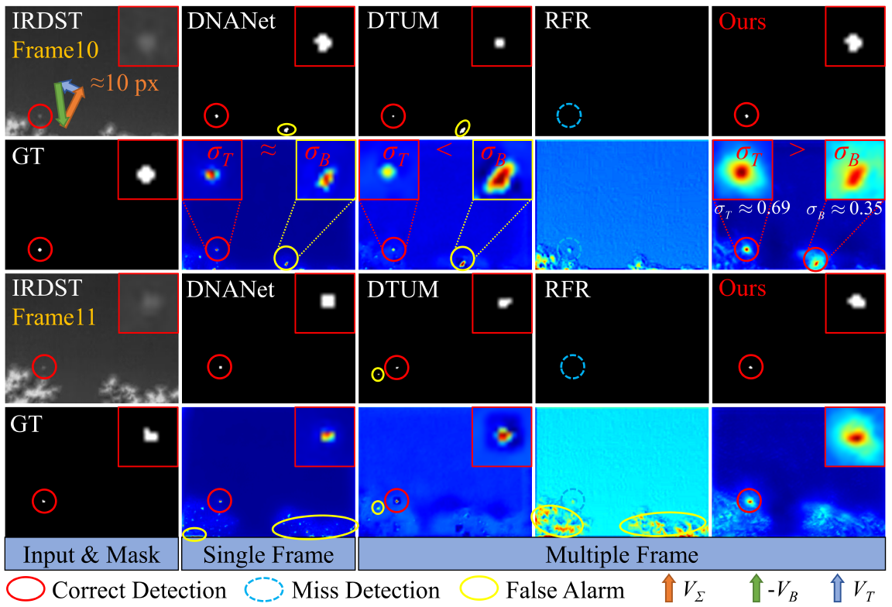
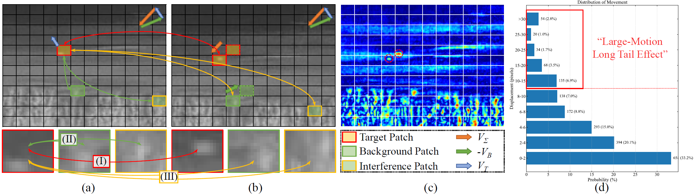
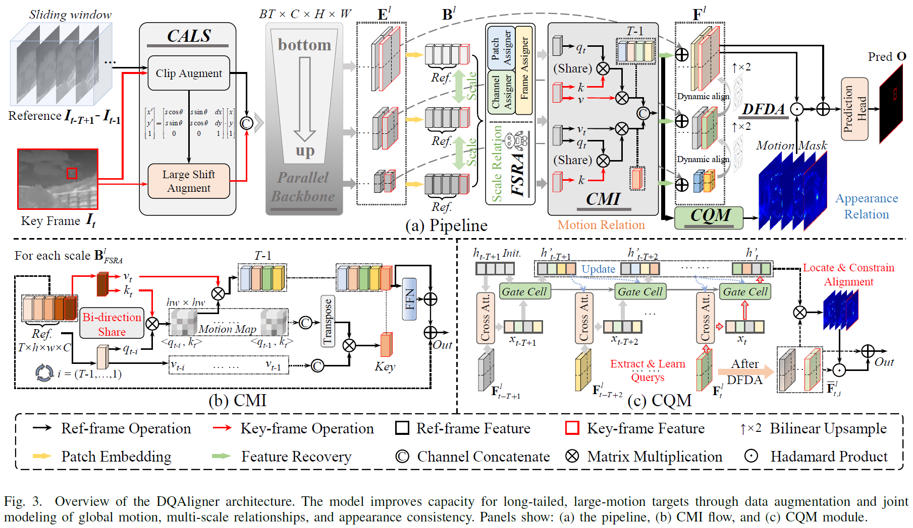
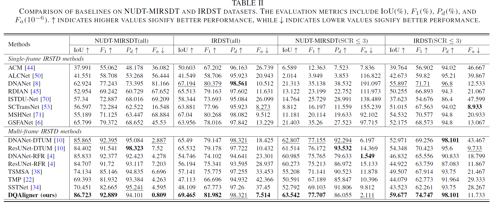
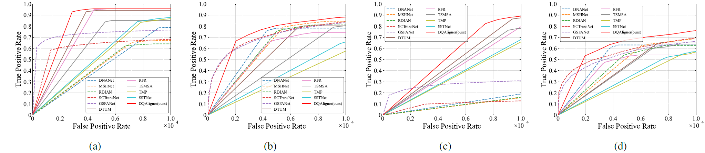

# *<center>Learning Global Dynamic Query for Large-Motion Infrared Small Target Detection</center>*

This repository contains the algorithm done in the work Learning Global Dynamic Query for Large-Motion Infrared Small Target Detection by Chuiyi Deng et al.

**News**:Thanks to the efforts of the editor and all the reviewers, our work has been accepted by IEEE TGRS 2026. If you find this paper helpful and inspiring, please cite the following format:
```
@article{deng2026learning,
  title={Learning Global Dynamic Query for Large--Motion Infrared Small Target Detection},
  author={Deng, Chuiyi and Guo, Yanyin and Xu, Xiang and Zhao, Zhuoyi and Xia, Yixin and An, Runxuan and Li, Junwei and Plaza, Antonio},
  journal={IEEE Transactions on Geoscience and Remote Sensing},
  year={2026},
  publisher={IEEE}
}
```

## Motivation



## Structure


## Results



## Domains
**Dataset**: 

NUDT-MIRSDT [Download](https://github.com/TinaLRJ/Multi-frame-infrared-small-target-detection-DTUM) 

IRDST [Download](https://github.com/lifier/LMAFormer) 

**Weights**: 

[Weight](./results/NUDT-MIRSDT/DQAligner/weight_NUDT-MIRSDT.pth) for NUDT-MIRSDT

[Weight](./results/IRDST/DQAligner/weight_IRDST.pth) for IRDST

**Update**: In `train.py`, `args.SpatialDeepSup` defaults to `False`. We recommend training without spatial deep supervision, as it may cause conflicts between deep and shallow Query learning.
Additionally, the `track_loss` returned by `DQAligner.py`  is also disabled by default, since we found that enabling it may reduce the flexibility of Query learning in representing features across frames. However, readers may refer to it for further performance optimization.

Thanks to Ruojing Li for the suggestion!

## Requirements
- Python 3.8
- pytorch (1.10.1+cu11.1), torchvision (0.11.2+cu11.1)

## Build 
DCN Compiling
1. Cd to ```./model/dcn```.
2. Run ```bash make.sh```. The scripts will build D3D automatically and create some folders.
3. See `test.py` for example usage.

## Commands for Training
* Run `train.py` to perform network training. Example for training on `[dataset_name]` datasets:
  ```
  $ cd ./codes
  $ python train.py --dataset 'IRDST'
  ```
* Checkpoints and Logs will be saved to `./results/`.
<be>

## Commands for Test
* Run `test.py` to perform network inference. Example for test on `[dataset_name]` datasets:
  ```
  $ cd ./codes
  $ python test.py --dataset 'IRDST' --weight_path 'results/IRDST/DQAligner/weight_IRDST.pth' --save_img False
  ```
* Network preditions will be saved to `./results/`.

## Acknowledge
*This code is highly borrowed from [DTUM](https://github.com/TinaLRJ/Multi-frame-infrared-small-target-detection-DTUM). Thanks to Ruojing Li.

*This code is highly borrowed from [IRSTD-Toolbox](https://github.com/XinyiYing/BasicIRSTD) and [RFR](https://github.com/XinyiYing/RFR). Thanks to Xinyi Ying.

*This code is highly borrowed from [SCTransNet](https://github.com/xdFai/SCTransNet). Thanks to Shuai Yuan.


